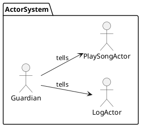
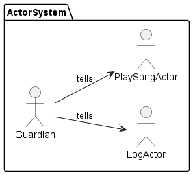
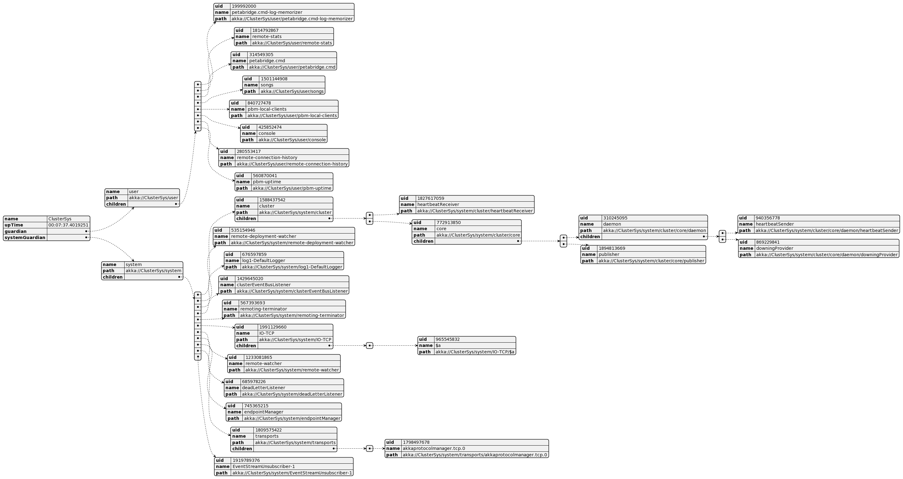
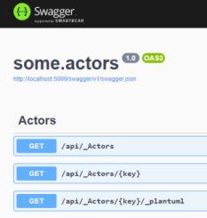

# ActorSystems with PlantUml.Net

[KevReed/PlantUml.Net](https://github.com/KevReed/PlantUml.Net) is a .Net wrapper for [PlantUml](http://plantuml.com/)

## About Actor Models

The [Actor Model](https://en.wikipedia.org/wiki/Actor_model) is one design pattern to meet meet the unique challenges of highly [distributed systems](https://en.wikipedia.org/wiki/Distributed_computing).

Not as popular as [Stream Processing Platforms](https://en.wikipedia.org/wiki/Stream_processing) like e.g. [Apache Kafka](https://kafka.apache.org/), the Actor Model might still be a good fit for a similar range of problems, cf.

- [What Problems Does the Actor Model Solve?](https://getakka.net/articles/intro/what-problems-does-actor-model-solve.html)

A common challenge is to visualize _Actor Systems_ to better understand their inner workings, especially when the system is distributed across multiple machines or spans large hierarchies of actors.

Here is a simple example of an Actor System with 3 actors, 2 of which are children of the root actor.





## Example Project

The example project `some.actors.sln` uses [Akka.Net](https://getakka.net/) to create a simple Actor System.

TL;DR: The final result looks like this:



For starters we used the [custom dotnet templates](https://learn.microsoft.com/en-us/dotnet/core/tools/custom-templates) of [PetaBridge](https://petabridge.com/) to create a new project, cf.

- [Petabridge.Templates](https://github.com/petabridge/petabridge-dotnet-new)
- [Petabridge.App.Web](https://github.com/petabridge/Petabridge.App.Web)

Next, we added some example actors and some [REST Api](https://en.wikipedia.org/wiki/Representational_state_transfer) controllers to reflect on the inner workings of the Actor System.

**NOTE:** Since [PlantUml](https://plantuml.com/) supports also [JSON](https://en.wikipedia.org/wiki/JSON), it is pretty simple to get a visualization of your Actor System.

You can run the project using

```shell
$ dotnet run --project some.actors/src/some.actors/some.actors.csproj
[INFO][19.11.2022 20:13:34][Thread 0001][remoting (akka://ClusterSys)] Starting remoting
[INFO][19.11.2022 20:13:34][Thread 0001][remoting (akka://ClusterSys)] Remoting started; listening on addresses : [akka.tcp://ClusterSys@localhost:9221]
[INFO][19.11.2022 20:13:34][Thread 0001][remoting (akka://ClusterSys)] Remoting now listens on addresses: [akka.tcp://ClusterSys@localhost:9221]
[INFO][19.11.2022 20:13:34][Thread 0001][Cluster (akka://ClusterSys)] Cluster Node [akka.tcp://ClusterSys@localhost:9221] - Starting up...
[INFO][19.11.2022 20:13:34][Thread 0001][Cluster (akka://ClusterSys)] Cluster Node [akka.tcp://ClusterSys@localhost:9221] - Started up successfully
[INFO][19.11.2022 20:13:34][Thread 0049][Cluster (akka://ClusterSys)] Cluster Node [0.3.0] - Node [akka.tcp://ClusterSys@localhost:9221] is JOINING itself (with roles [], version [0.3.0]) and forming a new cluster
[INFO][19.11.2022 20:13:34][Thread 0049][Cluster (akka://ClusterSys)] Cluster Node [akka.tcp://ClusterSys@localhost:9221] - is the new leader among reachable nodes (more leaders may exist)
[INFO][19.11.2022 20:13:34][Thread 0055][akka.tcp://ClusterSys@localhost:9221/user/petabridge.cmd] petabridge.cmd host bound to [0.0.0.0:9110]
[INFO][19.11.2022 20:13:34][Thread 0049][Cluster (akka://ClusterSys)] Cluster Node [akka.tcp://ClusterSys@localhost:9221] - Leader is moving node [akka.tcp://ClusterSys@localhost:9221] to [Up]
info: Microsoft.Hosting.Lifetime[14]
      Now listening on: http://localhost:5000
info: Microsoft.Hosting.Lifetime[14]
      Now listening on: https://localhost:5001
info: Microsoft.Hosting.Lifetime[0]
      Application started. Press Ctrl+C to shut down.
info: Microsoft.Hosting.Lifetime[0]
      Hosting environment: Development
```

Finally, you can request the PlantUml-model of the Actor System using

```shell
$ curl http://localhost:5000/api/_Systems/ClusterSys/_plantuml
@startjson
{
  "name": "ClusterSys",
  "upTime": "00:01:58.0700444",
  "guardian": {
    "name": "user",
    "path": "akka://ClusterSys/user",
    "children": [
      ...
      {
        "uid": 815858693,
        "name": "songs",
        "path": "akka://ClusterSys/user/songs"
      },
      {
        "uid": 1805846811,
        "name": "console",
        "path": "akka://ClusterSys/user/console"
      },
      ...
    ]
  }
}
@endjson
```

You might also the Swagger UI at [http://localhost:5000/swagger](http://localhost:5000/swagger)


