# UI Sketches with Salt

[Salt](http://plantuml.com/salt.html) is a sub-project included in [PlantUML](http://plantuml.com) that may help you to design graphical interface.
You can use either `@startsalt` keyword, or `@startuml` followed by a line with salt keyword.

## Basic widgets

A window must start and end with brackets. You can then define:

- Button using `[` and `]`.
- Radio button using `(` and `)`.
- Checkbox using `[` and `]`.
- User text area using `"`

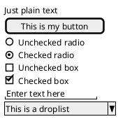

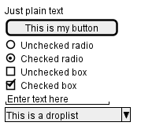

The goal of this tool is to discuss about simple and sample windows.

## Using grid

A table is automatically created when you use an opening bracket `{`.
And you have to use `|` to separate columns.
For example:

```plantuml
@startsalt
{
	Login    | "MyName   "
	Password | "****     "
	[Cancel] | [  OK   ]
}
@endsalt
```

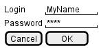

Just after the opening bracket, you can use a character to define if you want to draw lines or columns of the grid :

- `#` To display all vertical and horizontal lines
- `!` To display all vertical lines
- `-` To display all horizontal lines
- `+` To display external lines

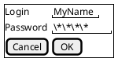

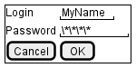

## Using separator

You can use several horizontal lines as separator.

```plantuml
@startsalt
{
      Text1
      ..
      "Some field"
      ==
      Note on usage
      ~~
      Another text
      --
      [Ok]
    }
@endsalt
```

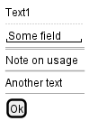

## Tree widget

To have a Tree, you have to start with `{T` and to use `+` to denote hierarchy.

```plantuml
@startsalt
{
    {T
     + World
     ++ America
     +++ Canada
     +++ USA
     ++++ New York
     ++++ Boston
     +++ Mexico
     ++ Europe
     +++ Italy
     +++ Germany
     ++++ Berlin
     ++ Africa
    }
}
@endsalt
```

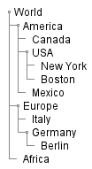

## Enclosing brackets

You can define sub-elements by opening a new opening bracket.

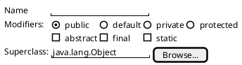

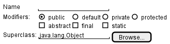

## Adding tabs

You can add tabs using `{/` notation. Note that you can use HTML code to have bold text.

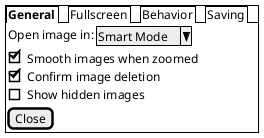

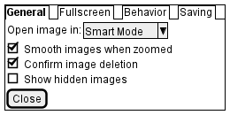

Tab could also be vertically oriented:

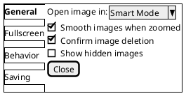

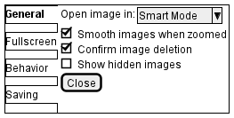

## Using menu

You can add a menu by using `{*` notation.

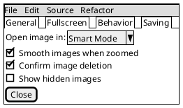

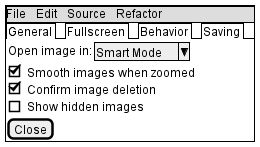

It is also possible to open a menu:

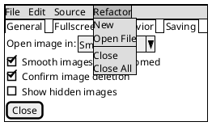

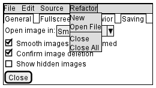

## Advanced table

You can use two special notations for tables:

- `*` for a cell with span with left
- `.` for an empty cell

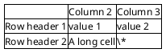

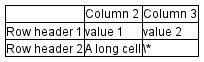

## OpenIconic

[OpenIconic]((https://useiconic.com/open/) is an very nice open source icon set. Those icons have been integrated into the creole parser, so you can use them out-of-the-box.
You can use the following syntax: `<&ICON_NAME>`.

```plantuml
@startsalt
{
	Login<&person> | "MyName   "
	Password<&key> | "****     "
	[Cancel <&circle-x>] | [OK <&account-login>]
}
@endsalt
```

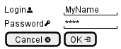

The complete list is available on [OpenIconic Website](https://useiconic.com/open/), or you can use the following special diagram:

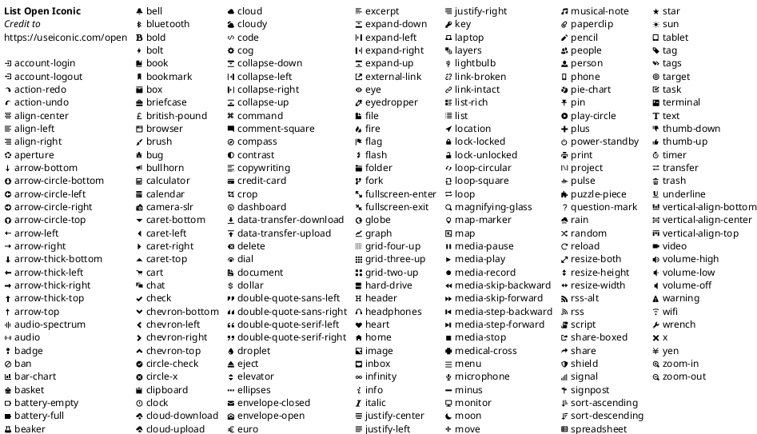

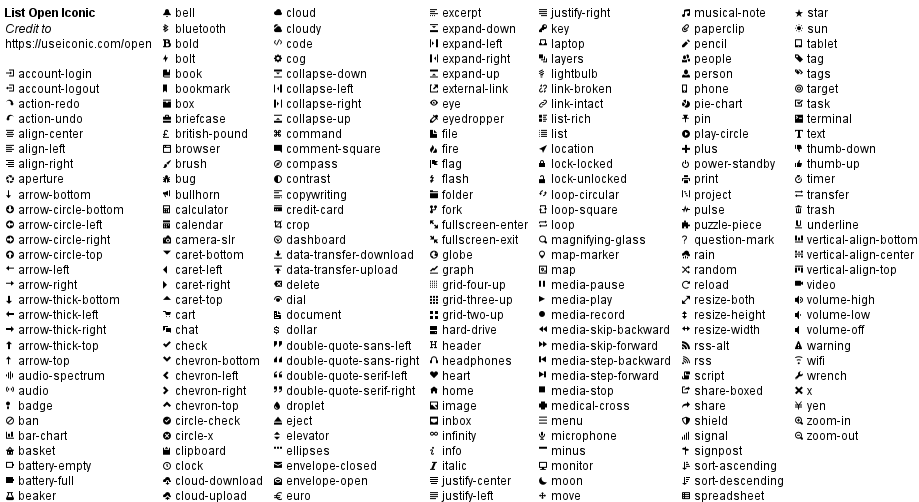
